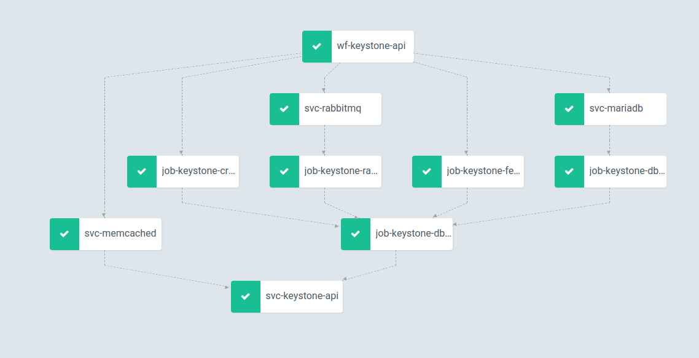

# argo-ohm
Argo POC

## Installation of kubernetes 

TBD

## Installation of argo itself

```bash
helm fetch argo/argo
tar xvf argo.xxx.tgz
helm install --name argo --namespace argo .
```

## Installation of keystone and associated services

you need to deploy mariadb, memcached and rabbitmq first by using
the helm chart available under openstackhelm-infra.
Potentially if you don't have a local helm server, ensure
that the helmtoolkit.tgz file is available each chart under charts/helmtoolkit.tgz

```bash
cd ../mariadb/
helm install --name mariadb --namespace openstack .
cd ../memcached/
helm install --name memcached --namespace openstack .
cd ../rabbitmq/
helm install --name rabbitmq --namespace openstack .
kubectl get all -n openstack
```

## argo cli

### Deployment

```bash
cd keystone-argo-cli
argo submit -n openstack wf-mariadb.yaml
argo submit -n openstack wf-memcached.yaml
argo submit -n openstack wf-rabbitmq.yaml
argo submit -n openstack wf-keystone-api.yaml
argo submit -n openstack wf-keystone-bootstrap.yaml
```

```bash
argo get wf-keystone-api -n openstack
Name:                wf-keystone-api
Namespace:           openstack
ServiceAccount:      keystone-api
Status:              Succeeded
Created:             Tue Jan 29 17:19:45 -0600 (54 seconds ago)
Started:             Tue Jan 29 17:19:45 -0600 (54 seconds ago)
Finished:            Tue Jan 29 17:20:38 -0600 (1 second ago)
Duration:            53 seconds

STEP                                      PODNAME                     DURATION  MESSAGE
 ✔ wf-keystone-api
 ├---✔ svc-memcached                      wf-keystone-api-2517001386  4s
 ├---✔ svc-mariadb                        wf-keystone-api-1718994872  5s
 ├---✔ wf-keystone-db-sync
 |   ├---✔ svc-mariadb                    wf-keystone-api-3144285078  3s
 |   ├---✔ wf-keystone-db-init
 |   |   ├---✔ svc-mariadb                wf-keystone-api-1703586597  2s
 |   |   └---✔ job-keystone-db-init       wf-keystone-api-3354426817  3s
 |   ├---✔ job-keystone-credential-setup  wf-keystone-api-3324764547  3s
 |   ├---✔ job-keystone-fernet-setup      wf-keystone-api-2605329163  2s
 |   ├---✔ wf-keystone-rabbit-init
 |   |   ├---✔ svc-rabbitmq               wf-keystone-api-823436806   3s
 |   |   └---✔ job-keystone-rabbit-init   wf-keystone-api-1346041812  3s
 |   └---✔ job-keystone-db-sync           wf-keystone-api-1562708993  2s
 ├---✔ job-keystone-credential-setup      wf-keystone-api-196303985   3s
 ├---✔ job-keystone-fernet-setup          wf-keystone-api-740083775   3s
 ├---✔ wf-keystone-rabbit-init
 |   ├---✔ svc-rabbitmq                   wf-keystone-api-2519204236  2s
 |   └---✔ job-keystone-rabbit-init       wf-keystone-api-2526730454  3s
 └---✔ svc-keystone-api                   wf-keystone-api-1282227320  2s
```
### Note 1

the serviceAccountName field in the workflow is important. Each component of the openstackhelm is creating standalone serviceAccount.
I could not figure how to achieve the same level of granularity

### Note 2

Note having access to the templating language basically void the interest of the helm-toolkit. For instance dependencies in 
original helm chart, reference 

### Note 3

Approach is of such deploment is much more centralized. You don't let kubernetes do its thing anymore...aka initcontainer would
retry until dependency is resolved. Need to find the right balance between the two approaches.

### Note 4

ARGO UI is to some extend not as good as the "argo cli" and seems much slower


## Installation using helm chart

### Deployment

Argo is using a CRD pattern, so can be controlled through kubectl without using argo cli ....therefore let us helm and associated template language.

```bash
cd keystone-argo-helm
helm install --name armadalike-keystone --namespace .
```

### Note 1

Not much of the workflows has been templatized in the template directory

### Note 2

The workflow 'keystone-argo-helm/templates/wf-keystone.yaml' is an attempt to simulate an airship-armada like workflow/chart group.
One workflow (equivalent of chartgroup) is basically waiting for the other worflow completed (equivalent of helm chart).
Still having with serviceAccount. Interesting aspect is that we still have access to the templating of helm as for armada

## Combining new kubernetes-endpoint and workflow

### Deployment

```bash
cd kubernetesendpoint-argo-poc1
helm install --name argo-poc1 --namespace openstack .
```

### Notes

TBD

### Goal

To create the following DAG (very messy, sorry):
<p align="center">
  
</p>

## Removing jobs in keystone helm chart and replacing them with argo steps

### Development

- Brute force and ugly copy paste of keystone helm chart.
- helm template . --namespace openstack -x templates/jobs-xxx.yaml > templates/steps/_xxx.yaml
- Use include in the wf-keystone-api.yaml and replace "jobs" by "containers" and include the "steps/xxx.yaml"

### Deployment for debugging

Ensure that the "good" keystone helm chart has been run first. This procedure only necessary to understand
how the workflow works

```bash
cd kubernetesendpoint-argo-poc2
# helm install --name argo-poc2 --namespace openstack .

helm template . --namespace openstack -x templates/wf-keystone-api.yaml > debugging.yaml
argo submit -f debugging.yaml -n openstack
argo get wf-keystone-api -n openstack
```

### Deployment

```bash
cd ../argo-ohm/kubernetesendpoint-argo-poc
cd kubernetesendpoint-argo-poc2/
helm install --name keystone --namespace openstack .
```

### Notes

#### Notes 1
- volumes handling at the top of the workflow looks like kind of strange. Can't put on each container ?
- gradally running "git rm templates/jobs-xxx.yaml" after those have been converted to steps
- wf-roles.yaml is kind of ugly and contains all the roles that used to be created by the individual job.
- wf-keystone-sa is "role-binded" to all the roles that used to be created by the indivual job. We should be able to simplify that.

#### Notes 2

Still need to include the following steps
- _domain_manage
- _bootstrap

#### Notes 3

```bash
kubectl get all -n openstack

NAME                                             READY   STATUS      RESTARTS   AGE
pod/keystone-api-697d4bb54d-l8x4d                1/1     Running     0          15m
pod/mariadb-ingress-6766c8566-ddp8r              1/1     Running     0          18m
pod/mariadb-ingress-error-pages-8b9fd8dd-xnz25   1/1     Running     0          18m
pod/mariadb-server-0                             1/1     Running     0          18m
pod/memcached-memcached-5bc79f976c-rxwns         1/1     Running     0          17m
pod/rabbitmq-rabbitmq-0                          1/1     Running     0          17m
pod/wf-keystone-api-1273692324                   0/2     Completed   0          15m
pod/wf-keystone-api-1526467896                   0/1     Completed   0          15m
pod/wf-keystone-api-1632446228                   0/1     Completed   0          15m
pod/wf-keystone-api-1843436742                   0/2     Completed   0          15m
pod/wf-keystone-api-2693579121                   0/2     Completed   0          15m
pod/wf-keystone-api-3460448251                   0/1     Completed   0          15m
pod/wf-keystone-api-4103002611                   0/1     Completed   0          15m
pod/wf-keystone-api-61866709                     0/2     Completed   0          15m
pod/wf-keystone-api-935314636                    0/2     Completed   0          15m

NAME                                  TYPE        CLUSTER-IP       EXTERNAL-IP   PORT(S)                        AGE
service/keystone                      ClusterIP   10.96.158.41     <none>        80/TCP,443/TCP                 15m
service/keystone-api                  ClusterIP   10.99.48.219     <none>        5000/TCP                       15m
service/mariadb                       ClusterIP   10.97.250.24     <none>        3306/TCP                       18m
service/mariadb-discovery             ClusterIP   None             <none>        3306/TCP,4567/TCP              18m
service/mariadb-ingress-error-pages   ClusterIP   None             <none>        80/TCP                         18m
service/mariadb-server                ClusterIP   10.104.100.199   <none>        3306/TCP                       18m
service/memcached                     ClusterIP   10.101.43.34     <none>        11211/TCP                      17m
service/rabbitmq                      ClusterIP   10.108.163.238   <none>        5672/TCP,25672/TCP,15672/TCP   17m
service/rabbitmq-dsv-7b1733           ClusterIP   None             <none>        5672/TCP,25672/TCP,15672/TCP   17m
service/rabbitmq-mgr-7b1733           ClusterIP   10.97.48.153     <none>        80/TCP,443/TCP                 17m

NAME                                          READY   UP-TO-DATE   AVAILABLE   AGE
deployment.apps/keystone-api                  1/1     1            1           15m
deployment.apps/mariadb-ingress               1/1     1            1           18m
deployment.apps/mariadb-ingress-error-pages   1/1     1            1           18m
deployment.apps/memcached-memcached           1/1     1            1           17m

NAME                                                   DESIRED   CURRENT   READY   AGE
replicaset.apps/keystone-api-697d4bb54d                1         1         1       15m
replicaset.apps/mariadb-ingress-6766c8566              1         1         1       18m
replicaset.apps/mariadb-ingress-error-pages-8b9fd8dd   1         1         1       18m
replicaset.apps/memcached-memcached-5bc79f976c         1         1         1       17m

NAME                                 READY   AGE
statefulset.apps/mariadb-server      1/1     18m
statefulset.apps/rabbitmq-rabbitmq   1/1     17m

NAME                                       SCHEDULE       SUSPEND   ACTIVE   LAST SCHEDULE   AGE
cronjob.batch/keystone-credential-rotate   0 0 1 * *      False     0        <none>          15m
cronjob.batch/keystone-fernet-rotate       0 */12 * * *   False     0        <none>          15m
```

#### Notes 4

```bash
argo list -n openstack

NAME              STATUS      AGE   DURATION
wf-keystone-api   Succeeded   16m   32s
```

```bash
argo get wf-keystone-api -n openstack

Name:                wf-keystone-api
Namespace:           openstack
ServiceAccount:      wf-keystone-sa
Status:              Succeeded
Created:             Thu Jan 31 14:08:11 -0600 (16 minutes ago)
Started:             Thu Jan 31 14:08:11 -0600 (16 minutes ago)
Finished:            Thu Jan 31 14:08:43 -0600 (16 minutes ago)
Duration:            32 seconds

STEP                                PODNAME                     DURATION  MESSAGE
 ✔ wf-keystone-api
 ├-✔ job-keystone-credential-setup  wf-keystone-api-1273692324  9s
 ├-✔ job-keystone-fernet-setup      wf-keystone-api-2693579121  9s
 ├-✔ svc-mariadb                    wf-keystone-api-4103002611  3s
 ├-✔ svc-memcached                  wf-keystone-api-1526467896  5s
 ├-✔ svc-rabbitmq                   wf-keystone-api-3460448251  4s
 ├-✔ job-keystone-db-init           wf-keystone-api-935314636   6s
 ├-✔ job-keystone-rabbit-init       wf-keystone-api-1843436742  6s
 ├-✔ job-keystone-db-sync           wf-keystone-api-61866709    16s
 └-✔ svc-keystone-api               wf-keystone-api-1632446228  2s
```
## Cleanup

```bash
helm delete --purge keystone
helm delete --purge mariadb
helm delete --purge memcached
helm delete --purge rabbitmq
kubectl delete configmap mariadb-mariadb-mariadb-ingress -n openstack
kubectl delete configmap mariadb-mariadb-state -n openstack
kubectl delete namespace openstack
```

## Conclusion

TBD

## Logs

```bash
argo logs wf-keystone-api -n openstack -w


svc-mariadb:    time="2019-01-31T20:08:13Z" level=info msg="Creating a docker executor"
svc-mariadb:    time="2019-01-31T20:08:13Z" level=info msg="Executor (version: v2.2.1, build_date: 2018-10-11T16:27:29Z) initialized with template:\narchiveLocation: {}\ninputs: {}\nmetadata: {}\nname: svc-mariadb\noutputs: {}\nresource:\n  action: get\n  manifest: |\n    apiVersion: v1\n    kind: Service\n    metadata:\n      name: mariadb\n  successCondition: metadata.name == mariadb\n"
svc-mariadb:    time="2019-01-31T20:08:13Z" level=info msg="Loading manifest to /tmp/manifest.yaml"
svc-mariadb:    time="2019-01-31T20:08:13Z" level=info msg="kubectl get -f /tmp/manifest.yaml -o name"
svc-rabbitmq:   time="2019-01-31T20:08:14Z" level=info msg="Creating a docker executor"
svc-rabbitmq:   time="2019-01-31T20:08:14Z" level=info msg="Executor (version: v2.2.1, build_date: 2018-10-11T16:27:29Z) initialized with template:\narchiveLocation: {}\ninputs: {}\nmetadata: {}\nname: svc-rabbitmq\noutputs: {}\nresource:\n  action: get\n  manifest: |\n    apiVersion: v1\n    kind: Service\n    metadata:\n      name: rabbitmq\n  successCondition: metadata.name == rabbitmq\n"
svc-rabbitmq:   time="2019-01-31T20:08:14Z" level=info msg="Loading manifest to /tmp/manifest.yaml"
svc-rabbitmq:   time="2019-01-31T20:08:14Z" level=info msg="kubectl get -f /tmp/manifest.yaml -o name"
svc-mariadb:    time="2019-01-31T20:08:14Z" level=info msg=service/mariadb
svc-mariadb:    time="2019-01-31T20:08:14Z" level=info msg="Waiting for conditions: metadata.name==mariadb"
svc-mariadb:    time="2019-01-31T20:08:14Z" level=info msg="kubectl get service/mariadb -w -o json"
svc-mariadb:    time="2019-01-31T20:08:14Z" level=info msg="{\"apiVersion\": \"v1\",\"kind\": \"Service\",\"metadata\": {\"creationTimestamp\":\"2019-01-31T20:06:00Z\",\"labels\": {\"application\": \"mariadb\",\"component\": \"ingress\",\"release_group\": \"mariadb\"},\"name\": \"mariadb\",\"namespace\": \"openstack\",\"resourceVersion\": \"370256\",\"selfLink\": \"/api/v1/namespaces/openstack/services/mariadb\",\"uid\": \"a1173585-2593-11e9-b736-0800272e6982\"},\"spec\": {\"clusterIP\": \"10.97.250.24\",\"ports\": [{\"name\": \"mysql\",\"port\": 3306,\"protocol\": \"TCP\",\"targetPort\": 3306}],\"selector\": {\"application\": \"mariadb\",\"component\": \"ingress\",\"release_group\": \"mariadb\"},\"sessionAffinity\": \"None\",\"type\": \"ClusterIP\"},\"status\": {\"loadBalancer\": {}}}"
svc-mariadb:    time="2019-01-31T20:08:14Z" level=info msg="success condition '{metadata.name == [mariadb]}' evaluated true"
svc-mariadb:    time="2019-01-31T20:08:14Z" level=info msg="1/1 success conditions matched"
svc-mariadb:    time="2019-01-31T20:08:14Z" level=info msg="Returning from successful wait for resource service/mariadb"
svc-mariadb:    time="2019-01-31T20:08:14Z" level=info msg="No output parameters"
svc-memcached:  time="2019-01-31T20:08:14Z" level=info msg="Creating a docker executor"
svc-memcached:  time="2019-01-31T20:08:14Z" level=info msg="Executor (version: v2.2.1, build_date: 2018-10-11T16:27:29Z) initialized with template:\narchiveLocation: {}\ninputs: {}\nmetadata: {}\nname: svc-memcached\noutputs: {}\nresource:\n  action: get\n  manifest: |\n    apiVersion: v1\n    kind: Service\n    metadata:\n      name: memcached\n  successCondition: metadata.name == memcached\n"
svc-memcached:  time="2019-01-31T20:08:14Z" level=info msg="Loading manifest to /tmp/manifest.yaml"
svc-memcached:  time="2019-01-31T20:08:14Z" level=info msg="kubectl get -f /tmp/manifest.yaml -o name"
svc-rabbitmq:   time="2019-01-31T20:08:15Z" level=info msg=service/rabbitmq
svc-rabbitmq:   time="2019-01-31T20:08:15Z" level=info msg="Waiting for conditions: metadata.name==rabbitmq"
svc-rabbitmq:   time="2019-01-31T20:08:15Z" level=info msg="kubectl get service/rabbitmq -w -o json"
svc-rabbitmq:   time="2019-01-31T20:08:15Z" level=info msg="{\"apiVersion\": \"v1\",\"kind\": \"Service\",\"metadata\": {\"creationTimestamp\":\"2019-01-31T20:06:24Z\",\"name\": \"rabbitmq\",\"namespace\": \"openstack\",\"resourceVersion\": \"370420\",\"selfLink\": \"/api/v1/namespaces/openstack/services/rabbitmq\",\"uid\": \"af96906d-2593-11e9-b736-0800272e6982\"},\"spec\": {\"clusterIP\": \"10.108.163.238\",\"ports\": [{\"name\": \"amqp\",\"port\": 5672,\"protocol\": \"TCP\",\"targetPort\": 5672},{\"name\": \"clustering\",\"port\": 25672,\"protocol\": \"TCP\",\"targetPort\": 25672},{\"name\": \"http\",\"port\": 15672,\"protocol\": \"TCP\",\"targetPort\": 15672}],\"selector\": {\"application\": \"rabbitmq\",\"component\": \"server\",\"release_group\": \"rabbitmq\"},\"sessionAffinity\": \"None\",\"type\": \"ClusterIP\"},\"status\": {\"loadBalancer\":{}}}"
svc-rabbitmq:   time="2019-01-31T20:08:15Z" level=info msg="success condition '{metadata.name == [rabbitmq]}' evaluated true"
svc-rabbitmq:   time="2019-01-31T20:08:15Z" level=info msg="1/1 success conditions matched"
svc-rabbitmq:   time="2019-01-31T20:08:15Z" level=info msg="Returning from successful wait for resource service/rabbitmq"
svc-rabbitmq:   time="2019-01-31T20:08:15Z" level=info msg="No output parameters"
svc-memcached:  time="2019-01-31T20:08:15Z" level=info msg=service/memcached
svc-memcached:  time="2019-01-31T20:08:15Z" level=info msg="Waiting for conditions: metadata.name==memcached"
svc-memcached:  time="2019-01-31T20:08:15Z" level=info msg="kubectl get service/memcached -w -o json"
svc-memcached:  time="2019-01-31T20:08:15Z" level=info msg="{\"apiVersion\": \"v1\",\"kind\": \"Service\",\"metadata\": {\"creationTimestamp\":\"2019-01-31T20:06:12Z\",\"name\": \"memcached\",\"namespace\": \"openstack\",\"resourceVersion\": \"370353\",\"selfLink\": \"/api/v1/namespaces/openstack/services/memcached\",\"uid\": \"a81f59f7-2593-11e9-b736-0800272e6982\"},\"spec\": {\"clusterIP\": \"10.101.43.34\",\"ports\": [{\"port\": 11211,\"protocol\": \"TCP\",\"targetPort\": 11211}],\"selector\": {\"application\": \"memcached\",\"component\": \"server\",\"release_group\": \"memcached\"},\"sessionAffinity\": \"ClientIP\",\"sessionAffinityConfig\": {\"clientIP\": {\"timeoutSeconds\": 10800}},\"type\": \"ClusterIP\"},\"status\": {\"loadBalancer\": {}}}"
svc-memcached:  time="2019-01-31T20:08:15Z" level=info msg="success condition '{metadata.name == [memcached]}' evaluated true"
svc-memcached:  time="2019-01-31T20:08:15Z" level=info msg="1/1 success conditions matched"
svc-memcached:  time="2019-01-31T20:08:15Z" level=info msg="Returning from successful wait for resource service/memcached"
svc-memcached:  time="2019-01-31T20:08:15Z" level=info msg="No output parameters"
job-keystone-fernet-setup:      2019-01-31 20:08:16.192 - INFO - Executing 'keystone-manage fernet_setup --keystone-user=keystone --keystone-group=keystone' command.
job-keystone-credential-setup:  2019-01-31 20:08:16.607 - INFO - Executing 'keystone-manage credential_setup --keystone-user=keystone --keystone-group=keystone' command.
job-keystone-rabbit-init:       Managing: User: keystone
job-keystone-rabbit-init:       user declared
job-keystone-rabbit-init:       Managing: vHost: keystone
job-keystone-rabbit-init:       vhost declared
job-keystone-rabbit-init:       Managing: Permissions: keystone on keystone
job-keystone-rabbit-init:       permission declared
job-keystone-rabbit-init:       Applying additional configuration
job-keystone-rabbit-init:       Imported definitions for rabbitmq.openstack.svc.cluster.local from "/tmp/rmq_definitions.json"
job-keystone-db-init:   2019-01-31 20:08:20,295 - OpenStack-Helm DB Init - INFO - Got DB root connection
job-keystone-db-init:   2019-01-31 20:08:20,296 - OpenStack-Helm DB Init - INFO - Using /etc/keystone/keystone.conf as db config source
job-keystone-db-init:   2019-01-31 20:08:20,296 - OpenStack-Helm DB Init - INFO - Trying to load db config from database:connection
job-keystone-db-init:   2019-01-31 20:08:20,296 - OpenStack-Helm DB Init - INFO - Got config from /etc/keystone/keystone.conf
job-keystone-fernet-setup:      2019-01-31 20:08:20,315.315 9 WARNING keystone.common.fernet_utils [-] key_repository is world readable: /etc/keystone/fernet-keys/
job-keystone-fernet-setup:      2019-01-31 20:08:20,316.316 9 INFO keystone.common.fernet_utils [-] Created a new temporary key: /etc/keystone/fernet-keys/0.tmp
job-keystone-fernet-setup:      2019-01-31 20:08:20,316.316 9 INFO keystone.common.fernet_utils [-] Become a valid new key: /etc/keystone/fernet-keys/0
job-keystone-fernet-setup:      2019-01-31 20:08:20,316.316 9 INFO keystone.common.fernet_utils [-] Starting key rotation with 1 key files: ['/etc/keystone/fernet-keys/0']
job-keystone-fernet-setup:      2019-01-31 20:08:20,317.317 9 INFO keystone.common.fernet_utils [-] Created a new temporary key: /etc/keystone/fernet-keys/0.tmp
job-keystone-fernet-setup:      2019-01-31 20:08:20,317.317 9 INFO keystone.common.fernet_utils [-] Current primary key is: 0
job-keystone-fernet-setup:      2019-01-31 20:08:20,318.318 9 INFO keystone.common.fernet_utils [-] Next primary key will be: 1
job-keystone-fernet-setup:      2019-01-31 20:08:20,318.318 9 INFO keystone.common.fernet_utils [-] Promoted key 0 to be the primary: 1
job-keystone-fernet-setup:      2019-01-31 20:08:20,320.320 9 INFO keystone.common.fernet_utils [-] Become a valid new key: /etc/keystone/fernet-keys/0
job-keystone-fernet-setup:      2019-01-31 20:08:20.429 - INFO - Updating data for 'keystone-fernet-keys' secret.
job-keystone-fernet-setup:      2019-01-31 20:08:20.477 - INFO - 2 fernet keys have been placed to secret 'keystone-fernet-keys'
job-keystone-fernet-setup:      2019-01-31 20:08:20.477 - INFO - Fernet keys generation has been completed
job-keystone-db-init:   2019-01-31 20:08:20,507 - OpenStack-Helm DB Init - INFO - Tested connection to DB @ mariadb.openstack.svc.cluster.local:3306 as root
job-keystone-db-init:   2019-01-31 20:08:20,508 - OpenStack-Helm DB Init - INFO - Got user db config
job-keystone-db-init:   2019-01-31 20:08:20,533 - OpenStack-Helm DB Init - INFO - Created database keystone
job-keystone-db-init:   2019-01-31 20:08:20,549 - OpenStack-Helm DB Init - INFO - Created user keystone for keystone
job-keystone-db-init:   2019-01-31 20:08:20,565 - OpenStack-Helm DB Init - INFO - Tested connection to DB @ mariadb.openstack.svc.cluster.local:3306/keystone as keystone
job-keystone-db-init:   2019-01-31 20:08:20,565 - OpenStack-Helm DB Init - INFO - Finished DB Management
job-keystone-credential-setup:  2019-01-31 20:08:20,660.660 8 WARNING keystone.common.fernet_utils [-] key_repository is world readable: /etc/keystone/credential-keys/
job-keystone-credential-setup:  2019-01-31 20:08:20,661.661 8 INFO keystone.common.fernet_utils [-] Created a new temporary key: /etc/keystone/credential-keys/0.tmp
job-keystone-credential-setup:  2019-01-31 20:08:20,661.661 8 INFO keystone.common.fernet_utils [-] Become a valid new key: /etc/keystone/credential-keys/0
job-keystone-credential-setup:  2019-01-31 20:08:20,661.661 8 INFO keystone.common.fernet_utils [-] Starting key rotation with 1 key files: ['/etc/keystone/credential-keys/0']
job-keystone-credential-setup:  2019-01-31 20:08:20,661.661 8 INFO keystone.common.fernet_utils [-] Created a new temporary key: /etc/keystone/credential-keys/0.tmp
job-keystone-credential-setup:  2019-01-31 20:08:20,661.661 8 INFO keystone.common.fernet_utils [-] Current primary key is: 0
job-keystone-credential-setup:  2019-01-31 20:08:20,662.662 8 INFO keystone.common.fernet_utils [-] Next primary key will be: 1
job-keystone-credential-setup:  2019-01-31 20:08:20,662.662 8 INFO keystone.common.fernet_utils [-] Promoted key 0 to be the primary: 1
job-keystone-credential-setup:  2019-01-31 20:08:20,662.662 8 INFO keystone.common.fernet_utils [-] Become a valid new key: /etc/keystone/credential-keys/0
job-keystone-credential-setup:  2019-01-31 20:08:20.741 - INFO - Updating data for 'keystone-credential-keys' secret.
job-keystone-credential-setup:  2019-01-31 20:08:20.760 - INFO - 2 fernet keys have been placed to secret 'keystone-credential-keys'
job-keystone-credential-setup:  2019-01-31 20:08:20.760 - INFO - Credential keys generation has been completed
job-keystone-db-sync:   + keystone-manage --config-file=/etc/keystone/keystone.conf db_sync
job-keystone-db-sync:   + keystone-manage --config-file=/etc/keystone/keystone.conf bootstrap --bootstrap-username admin --bootstrap-password password --bootstrap-project-name admin --bootstrap-admin-url http://keystone.default.svc.cluster.local:80/v3 --bootstrap-public-url http://keystone.default.svc.cluster.local:80/v3 --bootstrap-internal-url http://keystone-api.default.svc.cluster.local:5000/v3 --bootstrap-region-id RegionOne
job-keystone-db-sync:   2019-01-31 20:08:39,685.685 10 INFO keystone.cmd.cli [req-8f5cd894-5bb9-44ed-906e-6992c39eba31 - - - - -] Created domain default
job-keystone-db-sync:   2019-01-31 20:08:39,710.710 10 INFO keystone.cmd.cli [req-8f5cd894-5bb9-44ed-906e-6992c39eba31 - - - - -] Created project admin
job-keystone-db-sync:   2019-01-31 20:08:39,710.710 10 WARNING keystone.identity.core [req-8f5cd894-5bb9-44ed-906e-6992c39eba31 - - - - -] Unable to locate domain config directory: /etc/keystonedomains
job-keystone-db-sync:   2019-01-31 20:08:39,766.766 10 INFO keystone.cmd.cli [req-8f5cd894-5bb9-44ed-906e-6992c39eba31 - - - - -] Created user admin
job-keystone-db-sync:   2019-01-31 20:08:39,778.778 10 INFO keystone.cmd.cli [req-8f5cd894-5bb9-44ed-906e-6992c39eba31 - - - - -] Created role admin
job-keystone-db-sync:   2019-01-31 20:08:39,791.791 10 INFO keystone.cmd.cli [req-8f5cd894-5bb9-44ed-906e-6992c39eba31 - - - - -] Granted adminon admin to user admin.
job-keystone-db-sync:   2019-01-31 20:08:39,808.808 10 INFO keystone.cmd.cli [req-8f5cd894-5bb9-44ed-906e-6992c39eba31 - - - - -] Created region RegionOne
job-keystone-db-sync:   2019-01-31 20:08:39,847.847 10 INFO keystone.cmd.cli [req-8f5cd894-5bb9-44ed-906e-6992c39eba31 - - - - -] Created adminendpoint http://keystone.default.svc.cluster.local:80/v3
job-keystone-db-sync:   2019-01-31 20:08:39,858.858 10 INFO keystone.cmd.cli [req-8f5cd894-5bb9-44ed-906e-6992c39eba31 - - - - -] Created internal endpoint http://keystone-api.default.svc.cluster.local:5000/v3
job-keystone-db-sync:   2019-01-31 20:08:39,881.881 10 INFO keystone.cmd.cli [req-8f5cd894-5bb9-44ed-906e-6992c39eba31 - - - - -] Created public endpoint http://keystone.default.svc.cluster.local:80/v3
job-keystone-db-sync:   2019-01-31 20:08:39,886.886 10 INFO keystone.assignment.core [req-8f5cd894-5bb9-44ed-906e-6992c39eba31 - - - - -] Creating the default role 9fe2ff9ee4384b1894a90878d3e92bab because it does not exist.
job-keystone-db-sync:   + exec python /tmp/endpoint-update.py
job-keystone-db-sync:   2019-01-31 20:08:40,152 - OpenStack-Helm Keystone Endpoint management - INFO - Using /etc/keystone/keystone.conf as db config source
job-keystone-db-sync:   2019-01-31 20:08:40,152 - OpenStack-Helm Keystone Endpoint management - INFO - Trying to load db config from database:connection
job-keystone-db-sync:   2019-01-31 20:08:40,152 - OpenStack-Helm Keystone Endpoint management - INFO - Got config from /etc/keystone/keystone.conf
job-keystone-db-sync:   2019-01-31 20:08:40,205 - OpenStack-Helm Keystone Endpoint management - INFO - endpoint (admin): http://keystone.default.svc.cluster.local:80/v3
job-keystone-db-sync:   2019-01-31 20:08:40,205 - OpenStack-Helm Keystone Endpoint management - INFO - endpoint (internal): http://keystone-api.default.svc.cluster.local:5000/v3
job-keystone-db-sync:   2019-01-31 20:08:40,205 - OpenStack-Helm Keystone Endpoint management - INFO - endpoint (public): http://keystone.default.svc.cluster.local:80/v3
job-keystone-db-sync:   2019-01-31 20:08:40,205 - OpenStack-Helm Keystone Endpoint management - INFO - Finished Endpoint Management
svc-keystone-api:       time="2019-01-31T20:08:42Z" level=info msg="Creating a docker executor"
svc-keystone-api:       time="2019-01-31T20:08:42Z" level=info msg="Executor (version: v2.2.1, build_date: 2018-10-11T16:27:29Z) initialized with template:\narchiveLocation: {}\ninputs: {}\nmetadata: {}\nname: svc-keystone-api\noutputs: {}\nresource:\n  action: get\n  manifest: |\n    apiVersion: v1\n    kind: Service\n    metadata:\n      name: keystone-api\n  successCondition: metadata.name == keystone-api\n"
svc-keystone-api:       time="2019-01-31T20:08:42Z" level=info msg="Loading manifest to /tmp/manifest.yaml"
svc-keystone-api:       time="2019-01-31T20:08:42Z" level=info msg="kubectl get -f /tmp/manifest.yaml -o name"
svc-keystone-api:       time="2019-01-31T20:08:42Z" level=info msg=service/keystone-api
svc-keystone-api:       time="2019-01-31T20:08:42Z" level=info msg="Waiting for conditions: metadata.name==keystone-api"
svc-keystone-api:       time="2019-01-31T20:08:42Z" level=info msg="kubectl get service/keystone-api -w -o json"
svc-keystone-api:       time="2019-01-31T20:08:42Z" level=info msg="{\"apiVersion\": \"v1\",\"kind\": \"Service\",\"metadata\": {\"creationTimestamp\": \"2019-01-31T20:08:11Z\",\"name\": \"keystone-api\",\"namespace\": \"openstack\",\"resourceVersion\": \"370696\",\"selfLink\": \"/api/v1/namespaces/openstack/services/keystone-api\",\"uid\": \"eefd0ce5-2593-11e9-b736-0800272e6982\"},\"spec\": {\"clusterIP\": \"10.99.48.219\",\"ports\": [{\"name\": \"ks-pub\",\"port\": 5000,\"protocol\": \"TCP\",\"targetPort\": 5000}],\"selector\": {\"application\": \"keystone\",\"component\": \"api\",\"release_group\": \"keystone\"},\"sessionAffinity\": \"None\",\"type\": \"ClusterIP\"},\"status\": {\"loadBalancer\": {}}}"
svc-keystone-api:       time="2019-01-31T20:08:42Z" level=info msg="success condition '{metadata.name == [keystone-api]}' evaluated true"
svc-keystone-api:       time="2019-01-31T20:08:42Z" level=info msg="1/1 success conditions matched"
svc-keystone-api:       time="2019-01-31T20:08:42Z" level=info msg="Returning from successful wait for resource service/keystone-api"
svc-keystone-api:       time="2019-01-31T20:08:42Z" level=info msg="No output parameters"
```


